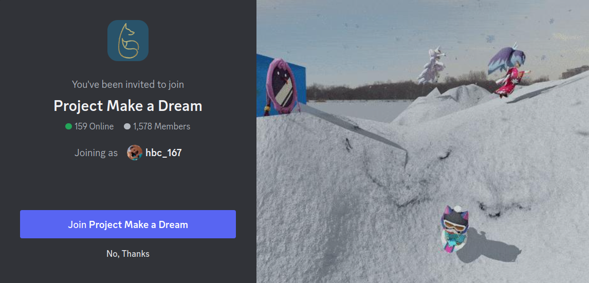

    
    
    
    
    

# Yo-Kai Watch 4++ Traduccion al español
Juego siendo traducido de manera manual desde la versión traducida al ingles.
# Importante
Este proyecto aún está en proceso, si encuentras algún error o algo que se deba arreglar abre un issue: [**ERROR**](https://github.com/REY3DS/YKW4_ES/issues)

**Es necesaria la actualización 2.2.0 del juego para que todo funcione sin errores.**
# Instalación
Descarga la última versión desde [***releases***](https://github.com/REY3DS/YKW4_ES/releases)

### Ryujinx:
En el directorio de datos de Ryujinx:
 - `/home/{USERNAME}/.config/Ryujinx/` en **Linux**.
 - `C:\users\{USERNAME}\AppData\Roaming\Ryujinx` en **Windows**.

Lo más probable es que la carpeta donde se necesiten poner los datos sea en `{...Ryujinx}/mods/contents/010086c00af7c000/`

### Switch
Para atmosphere: `Atmosphere/contents/010086c00af7c000`

Para SXOS: `SXOS/titles/010086c00af7c000`

# Creditos
- Vitaliy K. ([@Vitalkrilov](https://github.com/Vitalkrilov)) \- Traduccion entera del juego a ingles. (textos)

- Yo-kai Watch 4 English Translation Mod Team (check [gbatemp.net page](https://gbatemp.net/threads/wip-yo-kai-watch-4-switch-english-translation-project.580560/)) - Base del juego en inglés.

# PROJECT MAKE A DREAM
Make a Dream es un servidor de discord en el que están varias de las traducciones de los juegos de Yo-kai watch al español, mangas, y fan-games hechos por la comunidad.
Cualquier duda en el servidor, siempre contestamos.

> [Discord](https://discord.gg/project-make-a-dream-846980324034347008)

